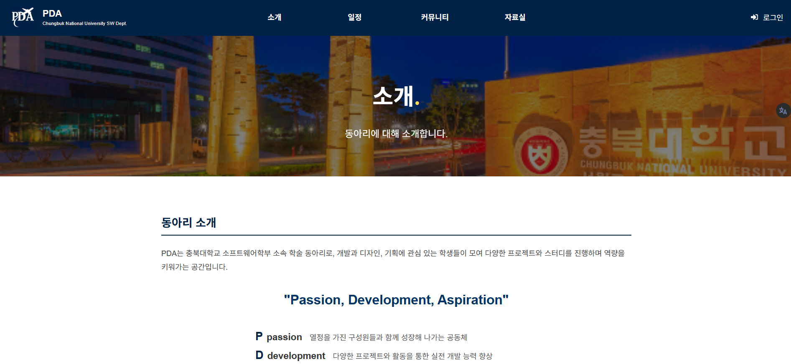
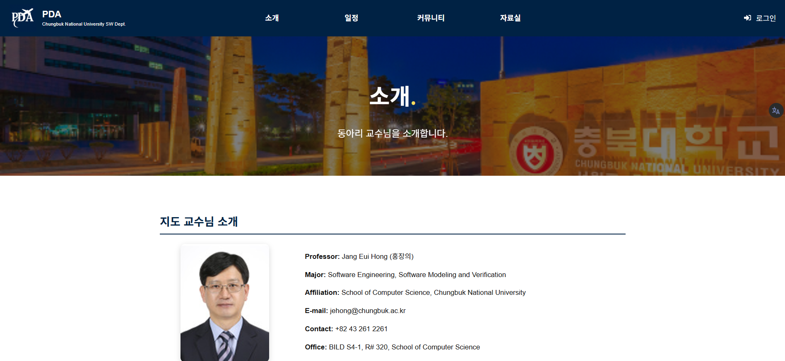
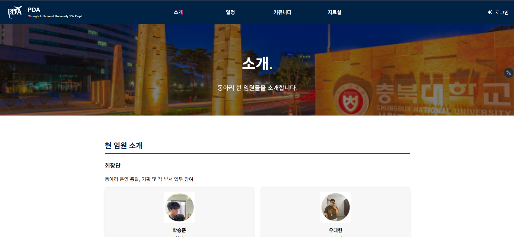
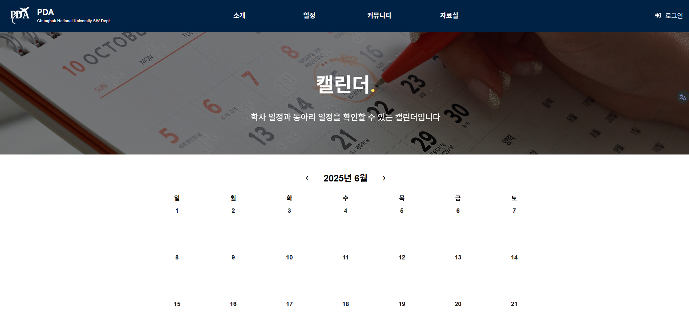
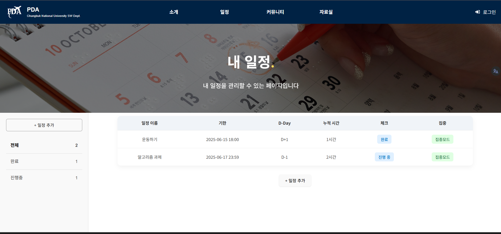
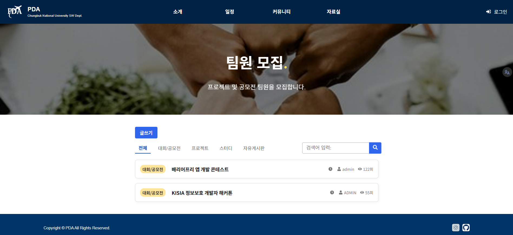
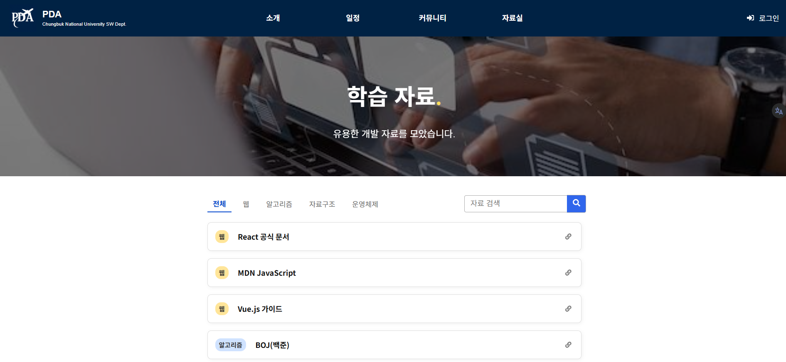
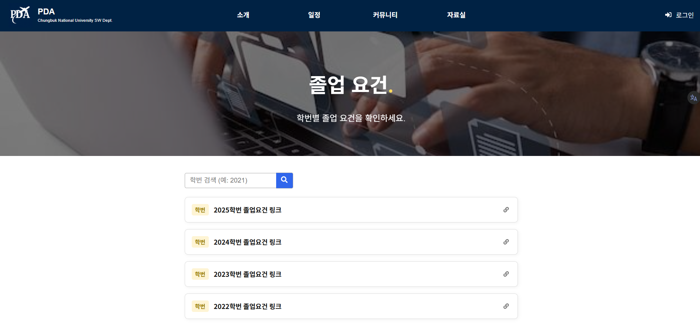

# PDA 동아리 홈페이지 🎓

충북대학교 소프트웨어학부 학술 동아리 **PDA** 공식 홈페이지입니다.  
React 기반 프론트엔드와 Node.js/Express 백엔드로 구현된 일정 관리 및 뽀모도로 타이머 기능이 있습니다.

---

## 🔍 프로젝트 개요

**목적**  
동아리 회의, 스터디, 공모전 등 공통 일정과 개인 학습을 통합 관리하기 위함.

**주요 기능**  
1. **캘린더 페이지**: 동아리 및 학교 공식 일정 조회/관리 (관리자 권한)  
2. **내 일정 페이지**: 개인 일정 생성/수정/삭제  
3. **뽀모도로 집중 모드**: 일정 항목마다 뽀모도로 타이머 실행  
4. **누적 시간 기록**: 집중 시간 자동 집계 및 개인 별 표시  
5. **소개, 커뮤니티, 자료실 메뉴**: 동아리 개요, 구성원 소개, 게시판, 자료 공유, 졸업요건 등

---

## 🗂 각 페이지 구성

### 1. **소개 페이지**
- **동아리 소개**: 동아리 목표 및 활동 설명  
- **교수님 소개**: 지도 교수님 정보 (사진, 약력 등)  
- **현 임원 소개**: 현재 운영진 프로필 표시

### 2. **캘린더 페이지**
- **동아리/학교 일정 조회**: 월·주 단위 캘린더  
- **관리자 일정 관리**: 일정 생성/편집/삭제 (API 연동)  
- (추후 예정) 외부 일정 Import/Export

### 3. **내 일정 페이지**
- **개인 일정 CRUD**  
- **동아리 일정 동시 표시**  
- **뽀모도로 기능 연동**: 일정 클릭 → 타이머 시작

### 4. **커뮤니티 페이지**
- **대회/공모전 게시판**: 공모전 정보 및 후기 공유  
- **프로젝트 게시판**: 팀 프로젝트 모집 및 결과 공유  
- **스터디 게시판**: 스터디 모집 및 후기  
- **자유게시판**: 일반 게시글, 공지 및 소통 공간

### 5. **자료실 페이지**
- **학습 자료**: 코드, 강의노트, 기출문제 등 파일 공유  
- **졸업 요건**: 학점, 실습, 공모전 등 졸업 기준 게시

### 6. **상단 NavBar 및 로그인**
- **PDA 로고 및 동아리명**  
- **로그인 버튼**: JWT + HttpOnly 쿠키 기반 인증  
- **반응형 Navbar**: 소개 · 일정 · 커뮤니티 · 자료실 메뉴 링크

---
## 📸 스크린샷

### 🏠 동아리 소개 페이지  


---

### 👩‍🏫 교수님 소개 페이지  


---

### 🧑‍💼 현 임원 소개 페이지  


---

### 📅 캘린더 페이지  


---

### 🗓 내 일정 페이지  


---

### 💬 커뮤니티 페이지  


---

### 📚 학습자료 페이지  


---

### 🎓 졸업요건 페이지  


## 💡 주요 기능 요약

- **캘린더 페이지**: 관리자 일정 관리, React FullCalendar 사용  
- **내 일정 & 뽀모도로**: 25분 집중 + 5분 휴식, 종료 시 누적 시간 자동 저장  
- **누적 시간 대시보드**: 개인별 집중 시간 집계 및 시각화 가능  
- **소개, 커뮤니티, 자료실**: 동아리 전체 운영과 정보 공유를 아우르는 구조

---

## ⚙️ 기술 스택

- **Frontend**: React (CRA), Bootstrap, CSS, JavaScript  
- **상태 관리**: Context API (필요시 Redux)  
- **Backend**: Node.js, Express  
- **인증**: JWT, HttpOnly 쿠키, bcrypt  
- **DB**: MySQL  
- **배포**: Docker + AWS EC2  
- **(추후 도입)** HTTPS, CI/CD (GitHub Actions 등)

---

## 🚀 설치 및 실행

```bash
git clone https://github.com/yourusername/pda-club-website.git
cd pda-club-website
git submodule update --init --recursive
docker-compose up --build
